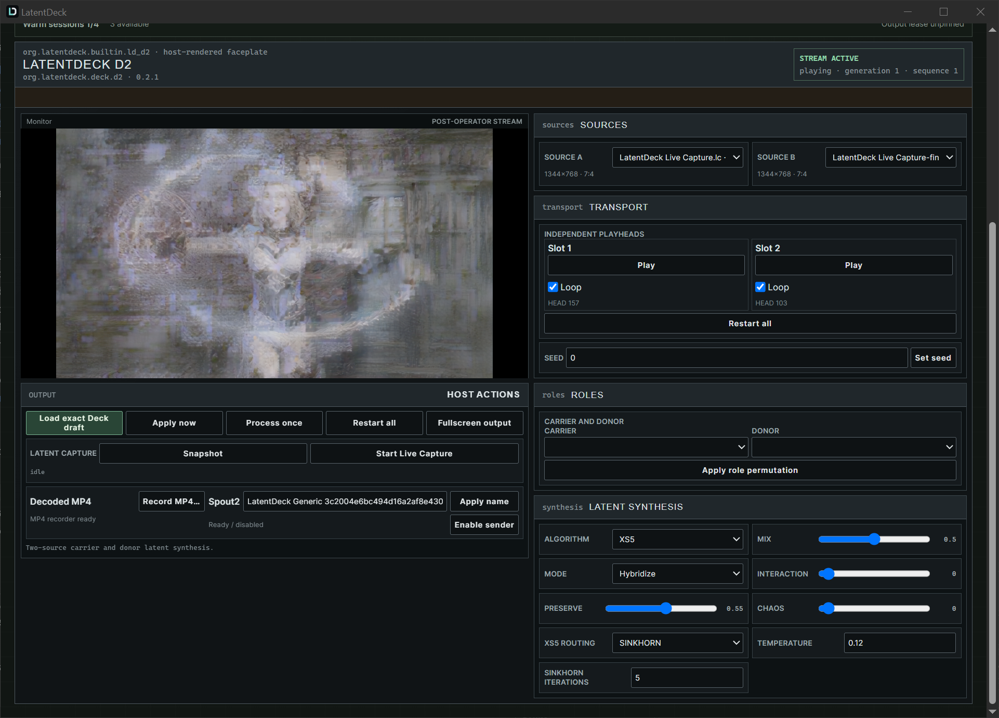
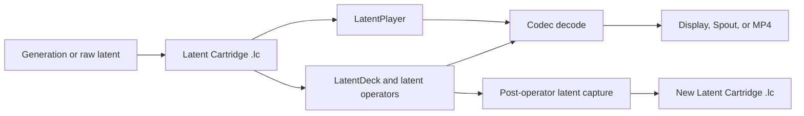

# LatentDeck

LatentDeck treats a saved generative latent representation as playable media
material. It provides an open cartridge format, realtime synthesis
applications, and extension contracts for working on latent signals before
they become pixels.

[Download the Windows preview](https://github.com/f00br/latentdeck/releases) ·
[Play the demo pack](#quick-start-play-the-demo-pack) ·
[Artist workflow](docs/guides/ARTIST_WORKFLOW.md) ·
[Developer documentation](docs/developers/README.md) ·
[Research directions](docs/research/RESEARCH_DIRECTIONS.md)



*LatentDeck D2 performing a two-source latent synthesis before H3 decode.*

[Library](docs/assets/screenshots/latentdeck-library-empty.png) ·
[D2 faceplate](docs/assets/screenshots/latentdeck-d2-missing-codec.png) ·
[Q4 faceplate](docs/assets/screenshots/latentdeck-q4-missing-codec.png) ·
[LatentPlayer](docs/assets/screenshots/latentplayer-empty.png) ·
[Showcase provenance](docs/assets/showcase/README.md) ·
[Interface screenshot provenance](docs/assets/screenshots/README.md)

## How it works

Generation and performance are separate stages:



An `.lc` cartridge is codec-neutral, data-only media. It records a validated
latent payload together with its codec identity, timing, provenance, and
genealogy; loading it never installs or executes code. H3 is the first
implemented codec profile, not the definition of the format.

## Quick start: play the demo pack

> **Unsigned preview:** `v0.1.0-preview.1` targets Windows 11 x64 and the
> current H3 runtime requires an NVIDIA CUDA device. The installers are not
> Authenticode-signed. Download them only from the official release and verify
> every SHA-256 before accepting an unknown-publisher or SmartScreen warning.

1. From one [GitHub release](https://github.com/f00br/latentdeck/releases),
   download `SHA256SUMS.txt` and the components you need:

   | Purpose | Download |
   | --- | --- |
   | Play one cartridge | `LatentPlayer-0.1.0-preview.1-windows-x64-unsigned-setup.exe` |
   | Organize and synthesize cartridges | `LatentDeck-0.1.0-preview.1-windows-x64-unsigned-setup.exe` |
   | Decode H3 in either application | both `LatentDeck-H3-CodecPack-0.2.1-setup.exe` and `LatentDeck-H3-CodecPack-0.2.1-windows-x64.ldcodec` |

   Keep the H3 setup and its exact `.ldcodec` side by side. Verify each file
   with, for example,
   `Get-FileHash -Algorithm SHA256 .\LatentPlayer-0.1.0-preview.1-windows-x64-unsigned-setup.exe`,
   and compare it with `SHA256SUMS.txt`.

2. Run the chosen application installer or install both, then run the H3
   setup. In each application, open **Extensions**, refresh, find exact H3
   `0.2.1`, and select **Enable**.

3. Configure the runtime explicitly:

   - In LatentPlayer, choose `CUDA` under **Player device**, then select
     **Use in Player**.
   - In LatentDeck, open LD-D2 or LD-Q4 and choose **Codec Pack version**
     `0.2.1`, **Negotiated device** `CUDA`, **Device ordinal** `0` for the
     first GPU, and **Codec profile**
     `minimax_h3/h3_av_latent@0.1.0`.

4. The Codec Pack does not contain a decoder weight. Download the declared
   [TAEH3 decoder](https://raw.githubusercontent.com/madebyollin/taehv/62f7591f59dfbb4c3c02b7a621d180a9eeaba26c/safetensors/taeh3.safetensors),
   then select that file through **Select decoder** in Player or **Codec
   assets → Choose file…** in a Deck. The accepted file is 22,709,752 bytes
   with SHA-256
   `4fd022bfcab08772fe0536b17ea1a3bbb5625be11e397868d1c5d891863d4c13`.
   Arbitrary renamed weights are refused.

5. Download the three cartridges and `SHA256SUMS.txt` from the pinned
   [LatentDeck Demo LC Pack](https://huggingface.co/datasets/f00br/latentdeck-demo-lc-pack/tree/a8eab9786d3efe2441ea18b14e7f61bb8ca7e665).
   The files share the same 1344 × 768 H3 synthesis geometry. The pack is
   separate from this repository and release; its current card does not grant
   reuse or redistribution rights, so treat it as evaluation material and do
   not mirror it. See the [demo-pack identity and checksums](docs/guides/DEMO_CARTRIDGES.md).

6. Choose a first path:

   - **Player:** select **Open cartridge**, open any downloaded `.lc`, and
     press **Play**.
   - **Deck:** select **Import .LC files**, open LD-D2, assign any two demo
     cartridges to A/B, then select **Load exact Deck draft**. Q4 has four
     slots; a cartridge may be reused, although three files do not demonstrate
     four-source diversity.

7. Continue with **Snapshot** or **Live Capture** to make a new `.lc`, or use
   **Record MP4** or Spout2 for decoded output. The demo cartridges contain an
   audio latent, but 0.1 preserves it without audio playback or synthesis;
   MP4 output is video-only.

For installation details, update/removal behavior, and the Comfy LC Recorder,
follow the [Windows installation guide](docs/guides/WINDOWS_INSTALL.md). The
[artist workflow](docs/guides/ARTIST_WORKFLOW.md) continues from first playback
through D2/Q4 synthesis, resampling, MP4, and Spout.

## Player or Deck?

| | LatentPlayer | LatentDeck |
| --- | --- | --- |
| Start with | one `.lc` cartridge | two compatible sources in D2 or four in Q4 |
| Primary use | inspect and play exact saved material | perform realtime pre-decode synthesis |
| Latent output | raw-to-`.lc` PREPARE workflow | Snapshot and bounded Live Capture to a new `.lc` |
| Decoded output | window, fullscreen, Spout2 | window, fullscreen, Spout2, video-only H.264 MP4 |

## What is implemented in 0.1

- **LatentPlayer** validates and plays `.lc` cartridges, and its PREPARE
  workspace converts supported raw latent files through an explicitly selected
  Codec Pack.
- **LatentDeck** organizes cartridges in a Library and runs installable `.ld`
  Decks through a common realtime host. Bundled D2 and Q4 use the same package,
  compatibility, faceplate, and Worker Protocol 2 boundaries available to
  external Decks.
- **Latent capture** records the post-operator state as a new `.lc` through
  Snapshot or bounded Live Capture. The result can immediately become source
  material for another performance.
- **Decoded output** is available in the application window, fullscreen,
  through Spout2, or as a video-only H.264 MP4.
- **Authoring and research tools** include a self-contained ComfyUI recorder,
  the LatentDeck Comfy Toolkit, Cartridge/Deck/Codec SDKs, package schemas, and
  CPU-first extension examples.
- **Extension lifecycle** validates, installs, verifies, explicitly enables,
  and selects immutable exact versions of `.ld` and `.ldcodec` packages.

The normative contracts live in the [Latent Cartridge
specification](spec/latent-cartridge/README.md), [Deck Package
specification](spec/deck-package/README.md), [Codec Package
specification](spec/codec-pack/README.md), and [Worker Protocol 2
specification](spec/worker-protocol/README.md).

## Extend and research

| I want to... | Start here |
| --- | --- |
| Record, play, synthesize, resample, or export material | [Artist workflow](docs/guides/ARTIST_WORKFLOW.md) |
| Prototype a latent operation | [Operator authoring](docs/developers/OPERATORS.md) |
| Build a realtime instrument | [Deck authoring](docs/developers/DECKS.md) |
| Support another latent family or decoder runtime | [Codec authoring](docs/developers/CODECS.md) |
| Read, validate, or derive `.lc` media | [Cartridge development](docs/developers/CARTRIDGES.md) |
| Understand the system and its boundaries | [Concept overview](docs/concepts/OVERVIEW.md) |
| Move from a question to an extension | [Research-to-extension guide](docs/developers/RESEARCH_TO_EXTENSION.md) |
| Explore latent-processing questions | [Research directions](docs/research/RESEARCH_DIRECTIONS.md) |
| Contribute to the project | [Contributing guide](CONTRIBUTING.md) |

The [documentation hub](docs/README.md) links every supported route, normative
specification, and maintainer guide.

## Important boundaries

- The 0.1 H3 runtime targets Windows x64 and an NVIDIA CUDA device. Performance
  is certified only by a receipt for the exact Deck mode, geometry, codec,
  decoder, GPU, and software stack that was measured.
- Cartridges with incompatible profile, geometry, timing, or runtime dtype are
  refused. LatentDeck does not silently resize, crop, align, cast, re-encode,
  substitute, or fall back.
- Audio metadata and an audio latent may be preserved by a cartridge, but 0.1
  does not provide audio playback or synthesis.
- `.lc` files are data-only. Deck and Codec packages may contain executable
  code and must be installed and enabled deliberately.
- Model weights, `.lc` cartridges, raw latents, generated media, and private
  datasets do not belong in this source repository.

## Community

Use GitHub Discussions for questions, research notes, and show-and-tell. Use
Issues for reproducible defects and scoped proposals. Contributions may arrive
through a fork or a branch in this repository, but all changes go through a
pull request and the same automated checks. An extension may also remain in an
independent repository and depend on LatentDeck without becoming part of the
core project.

Read [CONTRIBUTING.md](CONTRIBUTING.md), [GOVERNANCE.md](GOVERNANCE.md), and
[SUPPORT.md](SUPPORT.md) before opening a contribution. Report security issues
privately as described in [SECURITY.md](SECURITY.md).

## Build from source

LatentDeck uses pinned Rust, Node, pnpm, Python, uv, and NSIS contracts. Follow
the [developer quickstart](docs/developers/QUICKSTART.md), then run the complete
local gate:

```powershell
pwsh -NoProfile -File tools/Check-Workspace.ps1
```

## License

Original LatentDeck code and documentation are licensed under the [Apache
License 2.0](LICENSE). External codecs, model assets, cartridges, dependencies,
and media retain their own terms.
