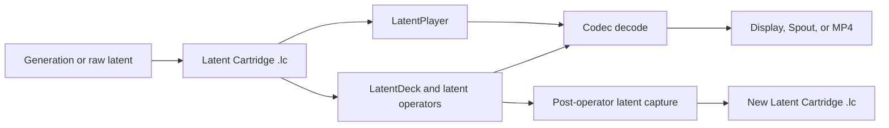

# LatentDeck

LatentDeck treats a saved generative latent representation as playable media
material. It is an open set of formats, applications, and extension contracts
for performing on that material before it becomes pixels.

Generation and performance are separate stages:



An `.lc` cartridge is codec-neutral, data-only media. It records a validated
latent payload together with its codec identity, timing, provenance, and
genealogy; loading it never installs or executes code. H3 is the first
implemented codec profile, not the definition of the format.

## Choose your path

| I want to... | Start here |
| --- | --- |
| Install the Windows applications and H3 Codec Pack | [Windows installation](docs/guides/WINDOWS_INSTALL.md) |
| Create, play, synthesize, resample, or record material as an artist | [Artist workflow](docs/guides/ARTIST_WORKFLOW.md) |
| Prototype a latent operation | [Operator authoring](docs/developers/OPERATORS.md) |
| Build a realtime instrument | [Deck authoring](docs/developers/DECKS.md) |
| Support another latent family or decoder runtime | [Codec authoring](docs/developers/CODECS.md) |
| Read, validate, or derive `.lc` media | [Cartridge development](docs/developers/CARTRIDGES.md) |
| Understand the system and its boundaries | [Concept overview](docs/concepts/OVERVIEW.md) |
| Explore a latent-processing question | [Research directions](docs/research/RESEARCH_DIRECTIONS.md) |
| Contribute to the project | [Contributing guide](CONTRIBUTING.md) |

The [documentation hub](docs/README.md) links every supported route, normative
specification, and maintainer guide.

## What is implemented in 0.1

- **LatentPlayer** validates and plays `.lc` cartridges, and its PREPARE
  workspace converts supported raw latent files through an explicitly selected
  Codec Pack.
- **LatentDeck** provides a Library and runs installable `.ld` Decks through a
  common realtime host. The bundled D2 and Q4 Decks use the same package,
  compatibility, faceplate, and Worker Protocol 2 boundaries available to
  external Decks.
- **Latent capture** records the post-operator state as a new `.lc` through
  Snapshot or bounded Live Capture. The result can immediately become source
  material for another performance.
- **Decoded output** is available in the application window, fullscreen,
  through Spout2, or as a video-only H.264 MP4.
- **Authoring and research tools** include a ComfyUI recorder, the LatentDeck
  Comfy Toolkit, Cartridge/Deck/Codec SDKs, package schemas, and CPU-first
  extension examples.
- **Extension lifecycle** validates, installs, verifies, explicitly enables,
  and selects immutable exact versions of `.ld` and `.ldcodec` packages.

The normative contracts live in the [Latent Cartridge
specification](spec/latent-cartridge/README.md), [Deck Package
specification](spec/deck-package/README.md), [Codec Package
specification](spec/codec-pack/README.md), and [Worker Protocol 2
specification](spec/worker-protocol/README.md).

## Preview downloads

The current binary release target is the unsigned Windows prerelease
`v0.1.0-preview.1`. When release assets are available, obtain every installer
and package from [GitHub Releases](https://github.com/f00br/latentdeck/releases);
do not use repacked mirrors.

The Windows application installers, H3 Codec Pack setup, adjacent `.ldcodec`
payload, self-contained Comfy LC Recorder bundle, and Developer Kit are
separate artifacts. Verify the release checksums before running them. The
Recorder bundle installs exact prebuilt wheels offline for ComfyUI's Windows
x64 CPython 3.12 or 3.13; Comfy Registry/Manager installation is not enabled
for this preview. The preview is not Authenticode-signed, so Windows may
display an unknown-publisher warning. See the [installation
guide](docs/guides/WINDOWS_INSTALL.md) before continuing through that warning.

The H3 Codec Pack does not contain model weights, a decoder asset, a generator,
ComfyUI, or cartridges. A compatible external decoder must be selected
explicitly after installation.

## Interface

These public-safe images show the application surfaces with empty data roots.
They are interface references, not examples of artistic output.


- [LD-D2 faceplate and missing-codec state](docs/assets/screenshots/latentdeck-d2-missing-codec.png)
- [LD-Q4 carrier/donor faceplate and missing-codec state](docs/assets/screenshots/latentdeck-q4-missing-codec.png)
- [LatentPlayer playback surface](docs/assets/screenshots/latentplayer-empty.png)
- [Screenshot provenance](docs/assets/screenshots/README.md)

## Important boundaries

- The 0.1 H3 runtime targets Windows x64 and an NVIDIA CUDA device. Performance
  is certified only by a receipt for the exact Deck mode, geometry, codec,
  decoder, GPU, and software stack that was measured.
- Cartridges with incompatible profile, geometry, timing, or runtime dtype are
  refused. LatentDeck does not silently resize, crop, align, cast, re-encode,
  substitute, or fall back.
- Audio metadata and an audio latent may be preserved by a cartridge, but 0.1
  does not provide audio playback or synthesis.
- Deck and Codec packages may contain executable code. They are separate trust
  boundaries and must be installed and enabled deliberately.
- Model weights, `.lc` cartridges, raw latents, generated media, and private
  datasets do not belong in this source repository.

## Community

Use GitHub Discussions for questions, research notes, and show-and-tell. Use
Issues for reproducible defects and scoped proposals. Contributions may arrive
through a fork or a branch in this repository, but all changes go through a
pull request and the same automated checks. An extension may also remain in an
independent repository and depend on LatentDeck without becoming part of the
core project.

Read [CONTRIBUTING.md](CONTRIBUTING.md), [GOVERNANCE.md](GOVERNANCE.md), and
[SUPPORT.md](SUPPORT.md) before opening a contribution. Report security issues
privately as described in [SECURITY.md](SECURITY.md).

## Build from source

LatentDeck uses pinned Rust, Node, pnpm, Python, uv, and NSIS contracts. Follow
the [developer quickstart](docs/developers/QUICKSTART.md), then run the complete
local gate:

```powershell
pwsh -NoProfile -File tools/Check-Workspace.ps1
```

## License

Original LatentDeck code and documentation are licensed under the [Apache
License 2.0](LICENSE). External codecs, model assets, cartridges, dependencies,
and media retain their own terms.
