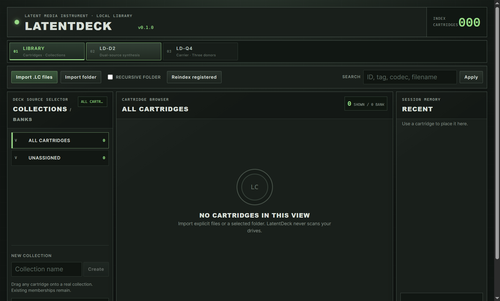

# LatentDeck

> LatentDeck treats saved generative latents as playable and synthesizable media
> signals.

LatentDeck is an open ecosystem around the codec-neutral **Latent Cartridge**
(`.lc`) format: record or convert a latent representation, play it, synthesize
it with other cartridges in real time, and resample the post-operator latent
state into a new cartridge.

## Repository status

On 2026-09-03 the owner accepted the completed Protocol 2 modular-runtime
milestone and the final local `0.1.0` application behavior on `main` at
implementation commit `3648e7c`. The repository is now in release-documentation
and publication preparation. The repository contains:

- public-repository boundaries and agent instructions;
- pinned Cargo, pnpm, uv, Tauri, Svelte, and Python workspaces;
- complete LatentDeck and LatentPlayer applications that play `.lc` cartridges,
  manage extensions, and prepare raw latent files when the selected Codec Pack
  declares that optional capability;
- normative LC 0.1 and H3 0.1 specifications;
- a deterministic Rust cartridge SDK and command-line tool;
- the native Python SDK binding, raw H3 `latentdeck-pack` authoring command,
  and `latentdeck-convert` batch converter for existing H3 AV Safetensors;
- the independent `Save Latent Cartridge (.lc)` ComfyUI recorder;
- the clean-room LatentDeck Comfy Toolkit research nodes and explicit-install
  external Operator API;
- one exact-hash lifecycle for local `.ld` Deck and `.ldcodec` Codec packages,
  including trust receipts, immutable side-by-side versions, explicit enable,
  verification, repair, removal, and a compatibility matrix;
- Codec and Deck SDKs, retained validated cartridge handles, and an authenticated
  Protocol 2 worker runtime shared by Player, bundled Decks, and external Decks;
- H3 Codec Pack/adapter `0.2.0` plus declarative LD-D2 and LD-Q4 packages
  `0.2.1`, all using the same generic runtime and native DX12 presentation;
- a shared SQLite Library with many-to-many Collections and virtual `All` and
  `Unassigned` banks;
- deterministic Snapshot and bounded Live Capture resampling back into `.lc`,
  including D2/Q4 capture across automatic source-loop boundaries and matching
  large application safety limits;
- upright video-only H.264 MP4 recording of D2/Q4 decoded output at intrinsic
  geometry;
- automatic Library-to-Deck invalidation and immediate use of a newly captured
  cartridge without reloading the Deck;
- up to four explicit warm Deck sessions with no LRU eviction and one foreground
  output lease that is pinned independently by Live Capture and MP4 recording;
- Spout2 output, structured diagnostics, database backup/migration, Windows
  application packaging, an independent current-user H3 Codec Pack setup, and
  SBOM generation;
- a public, data-free ComfyUI gallery with exactly 36 repository-owned nodes,
  strict registry equality, and isolated CPU visual acceptance;
- a policy for local-only, non-binding interface references.

The exact `3648e7c` implementation clone passed the aggregate workspace gate:
172 Deck frontend tests, 49 Player frontend tests, 694 Rust tests, and 422 Python
tests, with the expected private/child-process tests ignored. The owner then
accepted Player, D2, Q4, realtime controls, smooth playback, roles, finite
non-loop EOF, Snapshot, Live Capture and replay, MP4, fullscreen, Spout,
external compatible and incompatible Deck lifecycle, four warm sessions,
output-lease pinning, and the final compact declarative UI on the real CUDA/H3
runtime.

Clean `main` documentation checkpoint `0fd1303` repeated the full workspace and
public-tree gates and produced an unsigned first-install UAT set: both
application installers plus H3 `0.2.0` setup and its exact adjacent `.ldcodec`.
Generated receipts and `SHA256SUMS.txt` are authoritative for those bytes. This
post-build documentation update makes that set an older source snapshot; it
remains valid for the owner's installer UAT, but it is not a public release or
publication candidate. First-install UAT, authenticated signing, detailed
publication review, and owner-authorized publication remain open. Rebuild from
the final accepted commit before publication review. See the
[0.1.0 acceptance status](docs/release/ACCEPTANCE_STATUS.md). There is no
published release or supported bundled model in this repository.

## Implemented interfaces

The public screenshots come from the running applications with isolated empty
data and codec roots. They do not use the local concept sketches or private
cartridges.



- [LD-D2 faceplate and missing-codec state](docs/assets/screenshots/latentdeck-d2-missing-codec.png)
- [LD-Q4 carrier/donor faceplate and missing-codec state](docs/assets/screenshots/latentdeck-q4-missing-codec.png)
- [LatentPlayer empty playback surface](docs/assets/screenshots/latentplayer-empty.png)
- [Screenshot provenance and capture boundary](docs/assets/screenshots/README.md)

## Ecosystem components

- **LatentDeck App** — standalone real-time latent synthesis instrument.
- **LatentPlayer App** — `.lc` playback plus guided raw-H3 preflight and batch
  cartridge preparation; the console converter remains the developer surface.
- **Latent Cartridge Standard** — codec-neutral, data-only media container.
- **Cartridge SDK and APIs** — read, write, validate, inspect, hash, resample,
  codec adaptation, and operator integration.
- **ComfyUI-LatentCartridge** — small authoring package for recording generated
  latents into `.lc` files.
- **LatentDeck Comfy Toolkit** — separate research environment for operators,
  codecs, benchmarking, and offline experiments.

MiniMax H3 is the first intended codec profile. It is not the definition of
`.lc`, and H3 weights or cartridges are not distributed from this source tree.

## Windows installation boundary

LatentDeck App, LatentPlayer, and the H3 Codec Pack are three independent
Windows installations. Installing or removing one does not install, replace,
or remove either of the others.

The public H3 path is user-facing: keep
`LatentDeck-H3-CodecPack-<version>-setup.exe` beside the exact matching
`LatentDeck-H3-CodecPack-<version>-windows-x64.ldcodec`, then run the setup. The
large package remains adjacent rather than being embedded in the small setup, and
the setup accepts only the filename, byte length, SHA-256, pack identity, and
version bound into that executable. It installs for the current user at the
fixed `%LOCALAPPDATA%\LatentDeck\CodecPacks` root and registers exact-version
removal in Windows Installed Apps. It needs no administrator elevation,
network access, system Python, or PowerShell.

The Codec Pack does not contain a decoder weight or model. After installation,
open Extensions, refresh, enable the exact H3 version, choose it for Player or a
compatible Deck, and select an accepted external TAEH3 decoder. Bundled D2/Q4
are provisioned as exact trusted `.ld` packages; third-party Decks use the same
inspect, expected-SHA, install, and explicit-enable flow. No compatible version
is selected merely because it is newest. The PowerShell lifecycle scripts
remain engineering and recovery tools; they are not part of normal public
onboarding. See the
[H3 Codec Pack runbook](docs/release/H3_CODEC_PACK.md).

## Start here

- [Current release-preparation handoff](docs/release/continue.md)
- [Master-user test guide](docs/release/MASTER_USER_TEST.md)
- [0.1.0 acceptance status](docs/release/ACCEPTANCE_STATUS.md)
- [Project concept](docs/CONCEPT.md)
- [Latent Cartridge Specification 0.1](spec/latent-cartridge/README.md)
- [LC Manifest JSON Schema 0.1](spec/latent-cartridge/manifest.schema.json)
- [MiniMax H3 Codec Profile 0.1](spec/codec-h3/README.md)
- [Codec Package (`.ldcodec`) v2](spec/codec-pack/README.md)
- [Worker Protocol 2 and legacy Player bridge](spec/worker-protocol/README.md)
- [Deck Package (`.ld`) v1](spec/deck-package/README.md)
- [Python Codec SDK 0.2.0](sdk/codec-python/README.md)
- [Python Deck SDK 0.2.0](sdk/deck-python/README.md)
- [Deck Signal Contract 0.1](spec/deck-api/README.md)
- [Decoded MP4 output boundary](crates/output-mp4/README.md)
- [LatentPlayer PLAY/PREPARE workflow](apps/latentplayer/README.md)
- [Python Cartridge SDK, raw H3 packer, and converter](sdk/python/README.md)
- [ComfyUI-LatentCartridge recorder](comfy/latent-cartridge/README.md)
- [LatentDeck Comfy Toolkit](comfy/toolkit/README.md)
- [Explicit-install Operator API 0.1](spec/operator-api/README.md)
- [Agent runway](AGENTS.md)
- [Repository layout](docs/repository/REPOSITORY_LAYOUT.md)
- [Public repository boundary](docs/repository/REPOSITORY_BOUNDARY.md)
- [Public release checklist](docs/repository/PUBLIC_RELEASE_CHECKLIST.md)
- [Local Windows release engineering](docs/release/README.md)
- [Diagnostics and sanitized support bundles](docs/repository/DIAGNOSTICS.md)
- [Pinned toolchains](docs/repository/TOOLCHAINS.md)
- [Interface reference policy](docs/assets/concepts/README.md)
- [Contributing](CONTRIBUTING.md)
- [Security posture](SECURITY.md)

## Public-source boundary

The source repository is intended for code, specifications, documentation, and
explicitly reviewed public fixtures. Model weights, `.lc` cartridges, raw
latents, private datasets, generated output, local environments, and unreviewed
third-party assets are excluded by default.

Run the local guard before committing:

```powershell
pwsh -NoProfile -File tools/Test-PublicTree.ps1
```

Run the complete local workspace check with the pinned Node runtime:

```powershell
pwsh -NoProfile -File tools/Check-Workspace.ps1
```

## License

Original LatentDeck code and documentation are licensed under the
[Apache License 2.0](LICENSE). External codec assets, model weights,
cartridges, third-party code, and media retain their own terms and are not
covered merely by appearing near this project.
