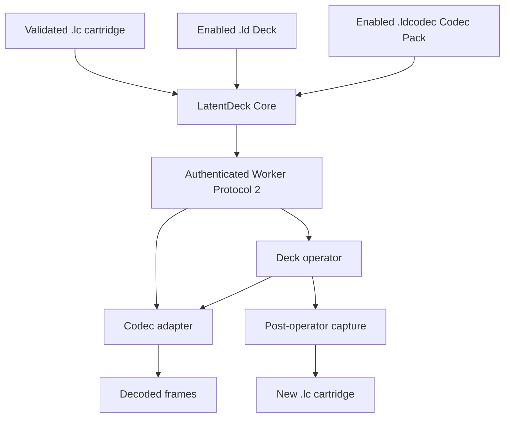

# Developer hub

LatentDeck exposes several extension points so a contributor can work at the
smallest boundary that fits an idea. You do not need to modify the applications
to explore a latent operation, and you do not need to modify the cartridge
format to support a new codec.

## Choose an extension surface

| Goal | Start with | Deliverable |
| --- | --- | --- |
| Read, validate, convert, or derive cartridge media | [Cartridges](CARTRIDGES.md) | Tool using the canonical Rust/Python SDK |
| Test latent math or an experimental topology | [Operators](OPERATORS.md) | Toolkit graph, single-file operator, or installable operator package |
| Build a realtime instrument with sources, roles, controls, and UI | [Decks](DECKS.md) | Deterministic `.ld` package |
| Support another latent family or decoder runtime | [Codecs](CODECS.md) | Deterministic `.ldcodec` package |
| Move an observation toward a maintained extension | [Research to extension](RESEARCH_TO_EXTENSION.md) | Reproducible evidence and the smallest suitable package |

Prepare the checkout through the [quickstart](QUICKSTART.md) and keep the
[compatibility matrix](COMPATIBILITY.md) beside any external project.

## Architecture at one glance



Core owns trust, validation, exact package selection, compatibility, sessions,
output, and final cartridge construction. A Deck owns source topology, roles,
operator controls, latent math, and a declarative faceplate. A Codec Pack owns
profile semantics, retained source reads, decode, and bounded capture staging.
The host—not an extension—owns native windows, fullscreen, Spout, MP4, and
Library import.

## Two operator contracts

LatentDeck intentionally has two operator paths:

- The **Comfy Toolkit Operator API 0.1** is for offline research and explicit
  installation into ComfyUI. It supports measurement, full-tensor experiments,
  and rapid iteration.
- The **Deck SDK 0.2.0** is the realtime callable contract inside an installable
  `.ld` package. It receives current latent slots, typed controls, roles,
  playheads, previous-source history, and deterministic context from the
  generic worker.

An operator does not become a Deck merely by changing its filename. Promotion
requires a package manifest, signal/role/control descriptor, declarative
faceplate, integrity catalog, compatibility tests, and explicit trust
lifecycle.

## Stable rules

- Use the canonical Cartridge SDK. Do not create a second permissive LC parser.
- Keep tensors finite, contiguous, and in the negotiated shape, dtype, and
  device unless an explicit authoring operation creates a different cartridge.
- Use explicit seeds and context; do not depend on wall-clock or ambient random
  state for a deterministic operator.
- Keep weights, decoder assets, cartridges, raw latents, and generated media out
  of source packages and the main repository.
- Treat `.ld` and `.ldcodec` as executable-code trust boundaries. Validation is
  not a sandbox.
- Use your own reverse-DNS namespace. `org.latentdeck.*` is reserved for
  project-built packages bound by the bundled index.
- Test success, rejection, no-clobber, deterministic output, and cleanup paths
  with bounded synthetic data.

## SDK manuals and reference implementations

- [Rust Cartridge SDK and CLI](../../crates/cartridge/README.md)
- [Python Cartridge SDK and raw H3 converter](../../sdk/python/README.md)
- [Python Deck SDK](../../sdk/deck-python/README.md)
- [Python Codec SDK](../../sdk/codec-python/README.md)
- [Extension Manager authoring and lifecycle CLI](../../crates/extension-manager/README.md)
- [ComfyUI-LatentCartridge recorder](../../comfy/latent-cartridge/README.md)
- [LatentDeck Comfy Toolkit and node inventory](../../comfy/toolkit/README.md)
- [Public Toolkit workflows](../../comfy/toolkit/workflows/README.md)
- [Channel Roll packaged operator example](../../operators/examples/channel-roll/README.md)
- [D2 reference Deck](../../operators/builtin/d2/README.md)
- [Q4 reference Deck](../../operators/builtin/q4/README.md)
- [Synthetic Codec example](../../examples/extensions/synthetic-codec/README.md)

The normative contracts, schemas, and component READMEs remain the source of
truth. If this guide and a specification differ, follow the specification and
open a documentation issue.

Validate the complete public CPU-first path with:

```powershell
pwsh -NoProfile -File tools/Test-DeveloperOnboarding.ps1
```
